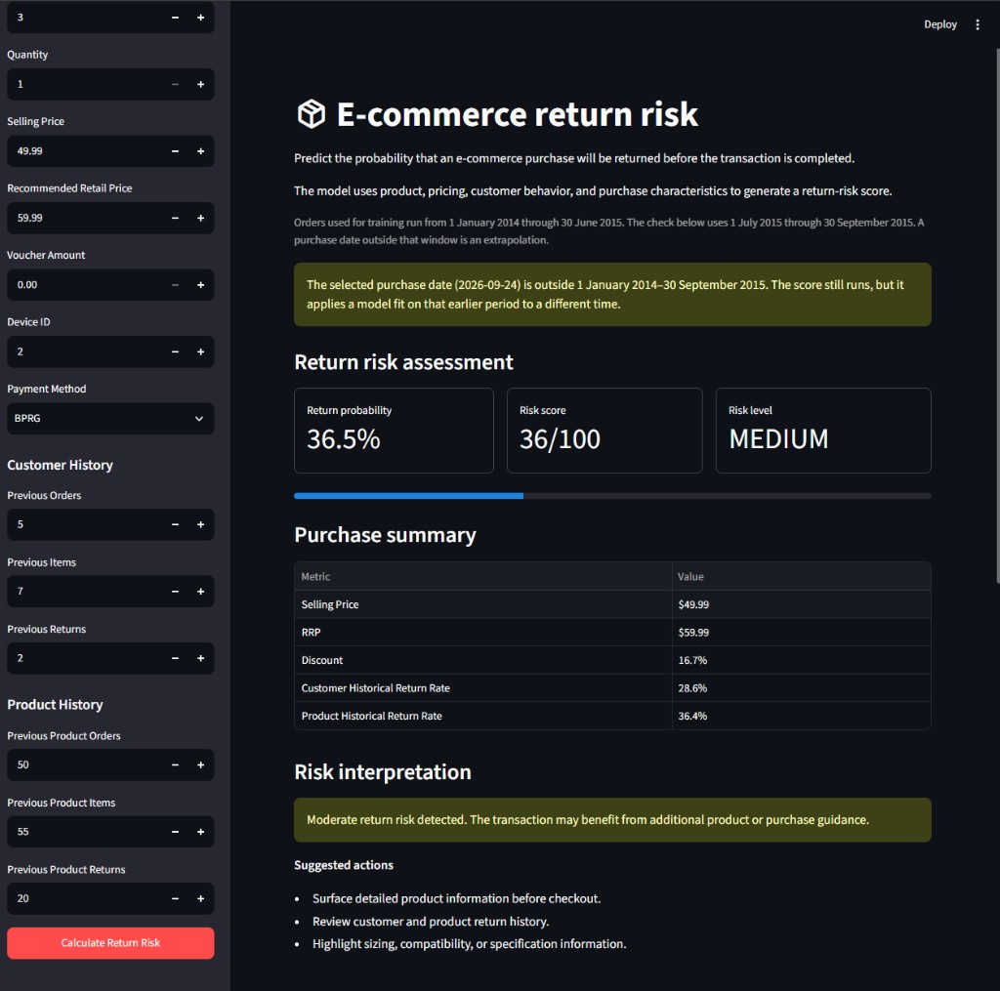
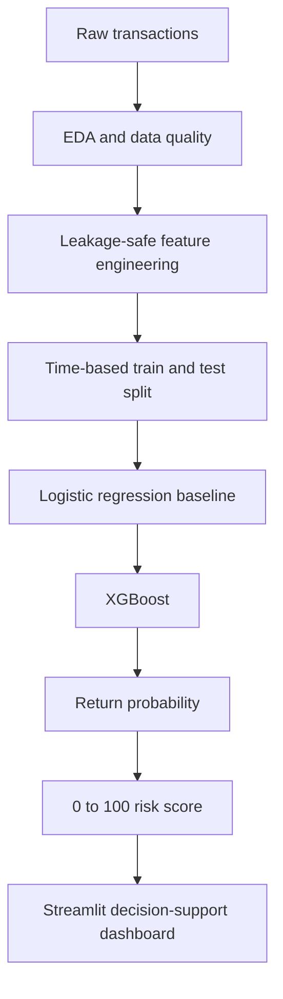
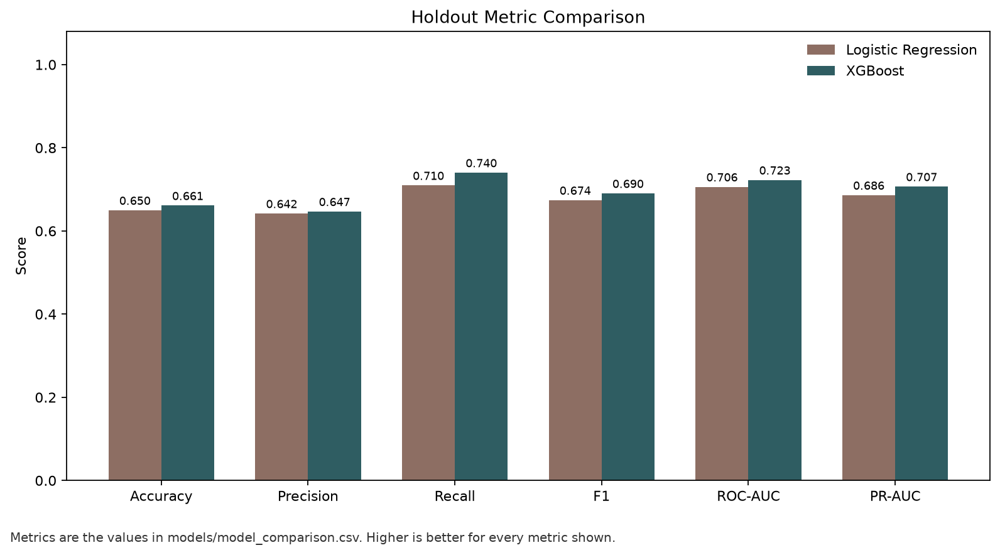
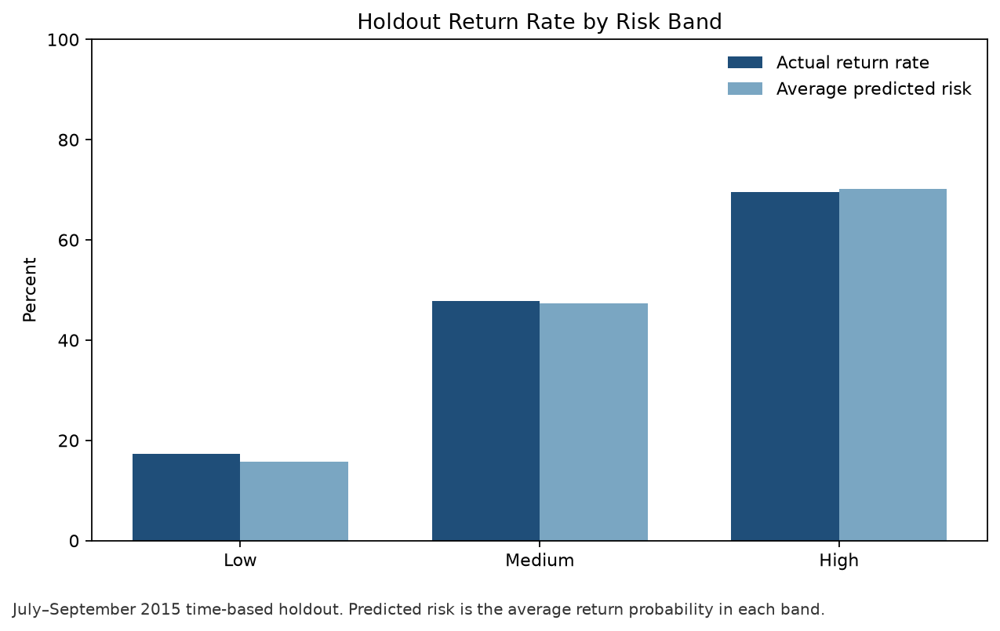
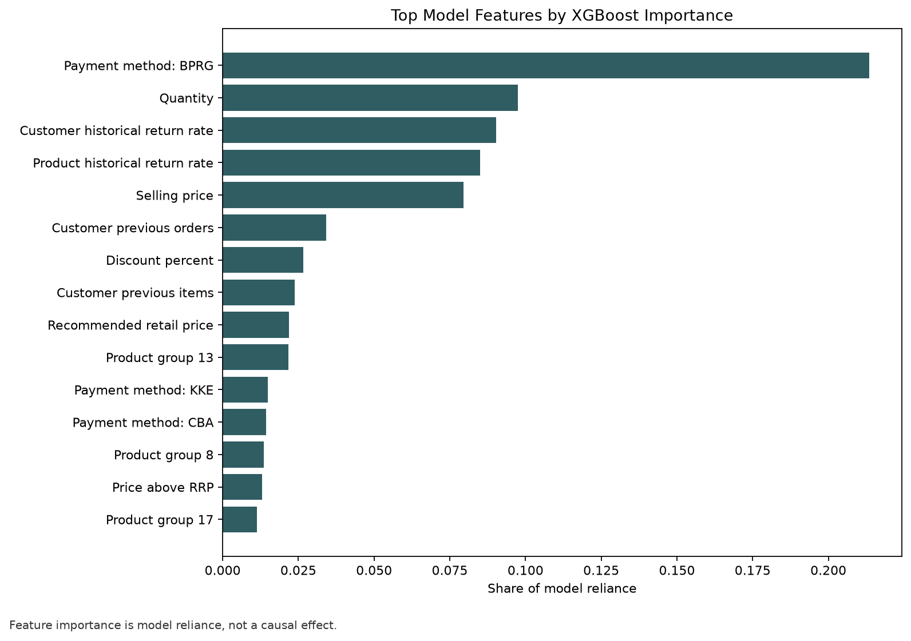

# E-Commerce Return Behavior & Product Risk Scorer

An end-to-end machine learning project that predicts the probability of an e-commerce transaction being returned before fulfillment and converts that prediction into an actionable 0–100 return-risk score.

The score is meant for decision support: flag a purchase, review the drivers that the model relies on, and choose a follow-up. This repository is a portfolio project. It was not deployed at a retailer.



## What was built

The project scores one order line before fulfillment.

| Output | Definition |
| --- | --- |
| Return probability | Estimated chance the line is returned |
| Risk score | Probability × 100, on a 0–100 scale |
| Risk segment | Low, Medium, or High |
| Interpretation | A short operational reading of that segment |

On a time-based holdout of purchases from 1 July 2015 through 30 September 2015, the final XGBoost model reached a ROC-AUC of 0.7226, compared with 0.7061 for a logistic regression baseline. Orders placed in the low band were returned 17.31% of the time. Orders in the high band were returned 69.63% of the time.

## Why it matters

Returned goods create reverse-logistics cost, extra inventory handling, and fulfillment work that has already been spent. The question this project asks is:

**Can historical customer behavior, product return behavior, pricing, discount, purchase context, and transaction characteristics identify transactions with elevated return risk before fulfillment?**

The model uses only information that would be known at prediction time. It does not claim to have reduced returns or saved a measured amount of money. Offline separation of risk bands is not the same thing as a production impact.

## Dataset

The source is the Data Mining Cup 2016 e-commerce returns dataset: anonymized fashion order lines.

| Fact | Value |
| --- | --- |
| Transaction rows | 2,325,165 |
| Unique orders | 738,698 |
| Customers | 311,369 |
| Products | 3,823 |
| Observed period in this project | 2014-01-01 through 2015-09-30 |
| Lines with a return (`returnQuantity > 0`) | 51.95% |

Each row is one order position: order, date, article, color, size, product group, quantity, price, recommended retail price (RRP), voucher, customer, device, payment method, and the quantity later returned.

The official DMC classification files for October–December 2015 are not part of this evaluation. Copies can sit locally under `data/raw/`, but the notebooks do not score them. The July–September 2015 window used below is a chronological holdout cut from the training file. It is not the official DMC competition test set.

The large raw and processed files are kept out of git. See [Data and license](#data-and-license).

## Workflow



| Step | Where |
| --- | --- |
| Exploration | `notebooks/01_data_exploration.ipynb` |
| Features | `notebooks/02_feature_engineering.ipynb` |
| Models, scores, and holdout check | `notebooks/03_model_training.ipynb` |
| Scoring code | `src/features.py`, `src/risk_scorer.py` |
| Application | `dashboard/app.py` |

## Exploratory analysis

The exploration notebook profiles the training file before modeling.

**Missing values.** `productGroup` and `rrp` are each missing on 351 rows. `voucherID` is missing on 6 rows. The other raw columns are complete.

**Returns are common, and usually one unit.** `returnQuantity` is 0 on 1,117,156 lines and 1 on 1,204,005 lines. A further 4,004 lines have a return quantity from 2 to 5.

**Product group.** Observed return rates differ by group. Product group 13, with 101,214 lines, has a return rate of 67.7%. Several other large groups sit in the high 50% range. The overall line-level return rate is 51.95%.

**Payment method.** BPRG covers 1,810,036 lines and has a 55.6% return rate. PAYPALVC, with 169,009 lines, has a 38.5% return rate. A few method codes have very small counts, including RG with 13 lines, so those rates are not stable comparisons.

**Device.** Devices that account for almost all of the volume (devices 2, 3, 4, and 5) have return rates from 51.0% to 53.7%. Device 1 has a higher rate but only 47 lines.

**Price and discount.** A raw discount of `(rrp - price) / rrp` is not always usable. There are 22,662 lines with a negative discount (price above RRP), 15,205 lines with RRP equal to 0, and 15,556 lines where that ratio is missing. The notebook also groups cleaned discounts into buckets and plots return rate by bucket. Those plots are in the notebook; this README does not restate a discount-rate curve beyond the data-quality counts above.

## Target and cleaning

The modeling target is binary:

`returned = 1` when `returnQuantity > 0`, otherwise `0`.

That matches the decision “will this line come back?” It also collapses return quantities of 2 through 5 into the same positive class as a single returned unit. Those multi-unit returns are 4,004 lines.

Cleaning used in the feature table:

- `rrp_missing` flags a missing recommended price.
- `discount_pct` is `(rrp - price) / rrp × 100`. Negative results, infinities, and undefined ratios (including RRP of 0) are set to 0.
- `price_above_rrp` flags a selling price strictly above a known RRP.

Missing `productGroup` is left for the model pipeline, which imputes the most frequent category before one-hot encoding.

## Leakage-safe history

Customer and product history are built from earlier orders only. The current order is shifted out of the counts, so the label being predicted is not an input.

A first pass counted earlier rows inside each customer or product. That treated two lines in the same order as if one had already happened. Those columns were dropped. The saved features are computed on one row per order, then joined back to every line in that order.

Customer history, known before the order:

- `customer_previous_orders`
- `customer_previous_items`
- `customer_previous_returns`
- `customer_historical_return_rate` = previous returns / previous items, or 0 when there is no prior item history

Product history, known before the order for that article:

- `product_previous_orders`
- `product_previous_items`
- `product_previous_returns`
- `product_historical_return_rate`

Order-level history matters because a basket can contain several articles. If one line’s return label were visible while scoring another line in the same order, the model would see an outcome that is not known before fulfillment. Sharing one pre-order history across the lines in that order avoids that leak.

## Model features

Numerical inputs are median-imputed. Logistic regression also standardizes them. XGBoost does not. `productGroup`, `deviceID`, and `paymentMethod` are imputed with the most frequent value and one-hot encoded. Unknown categories at score time are ignored.

**Transaction and pricing**

`quantity`, `price`, `rrp`, `voucherAmount`, `discount_pct`, `price_above_rrp`, `rrp_missing`

**Calendar**

`order_month`, `order_dayofweek`, `order_weekend`

**Customer history**

`customer_previous_orders`, `customer_previous_items`, `customer_previous_returns`, `customer_historical_return_rate`

**Product history**

`product_previous_orders`, `product_previous_items`, `product_previous_returns`, `product_historical_return_rate`

**Categorical**

`productGroup`, `deviceID`, `paymentMethod`

`order_day` is engineered in the feature notebook and is not a model input. Color, size, and voucher ID are not model inputs either.

## Time-based validation

A random row split would mix later purchases into training and would not match the use case, which is scoring a future purchase from history already on hand. The split is chronological.

| Split | Dates | Rows |
| --- | --- | --- |
| Training window | 2014-01-01 through 2015-06-30 | 1,955,978 |
| Holdout | 2015-07-01 through 2015-09-30 | 369,187 |

Logistic regression was fit on the full training window.

XGBoost was fit on a random sample of 500,000 rows drawn from that training window, for runtime. It was then scored on the full 369,187-row holdout. It was not fit on all 1,955,978 training rows.

The saved artifact is `models/xgboost_return_risk_pipeline.joblib`: a scikit-learn pipeline with preprocessing and `XGBClassifier` (`n_estimators=300`, `max_depth=6`, `learning_rate=0.1`, `tree_method="hist"`).

## Model comparison

Metrics below are the holdout results stored in `models/model_comparison.csv`, rounded to four decimal places.

| Model | Accuracy | Precision | Recall | F1 | ROC-AUC | PR-AUC |
| --- | ---: | ---: | ---: | ---: | ---: | ---: |
| Logistic regression | 0.6498 | 0.6419 | 0.7096 | 0.6741 | 0.7061 | 0.6861 |
| XGBoost | 0.6612 | 0.6468 | 0.7402 | 0.6904 | 0.7226 | 0.7067 |

XGBoost is the model used by the dashboard. The gain over logistic regression is consistent across these metrics and is modest. ROC-AUC of 0.7226 means the score ranks returned lines above kept lines better than chance, not that most individual predictions are certain.



## Risk score

```text
risk_score = predicted return probability × 100
```

| Segment | Rule |
| --- | --- |
| Low | probability < 0.30 |
| Medium | 0.30 ≤ probability < 0.60 |
| High | probability ≥ 0.60 |

These cutoffs are operational choices for this project. They are not an industry standard.

## Holdout risk bands

The same July–September 2015 holdout, scored by the saved XGBoost model:

| Segment | Transactions | Actual return rate | Average predicted risk |
| --- | ---: | ---: | ---: |
| Low | 62,437 | 17.31% | 15.75% |
| Medium | 164,793 | 47.79% | 47.34% |
| High | 141,957 | 69.63% | 70.21% |



The bands separate lower-return lines from higher-return lines, and the average predicted probability in each band is close to the observed return rate. That is evidence of useful ranking and reasonable segment-level agreement. It is not a claim of perfect calibration, and it was not measured as a drop in returns after a business intervention.

## What the model relies on



On the saved model, the largest shares of XGBoost importance are payment method BPRG, quantity, the customer’s historical return rate, the product’s historical return rate, and selling price. Customer previous orders and discount percent also appear in the top group. The chart shows the top 15.

These values are shares of model reliance: how often and how usefully the trees split on each input. They do not establish that changing a payment method, a price, or a customer’s history would cause the return rate to change.

## Streamlit application

`dashboard/app.py` loads the saved pipeline and scores one purchase.

**Inputs.** Purchase date, product group, quantity, selling price, RRP, voucher amount, device, payment method, and customer and product history counts.

**Outputs.** Return probability, 0–100 score, Low / Medium / High segment, a purchase summary, a short interpretation with suggested actions, the holdout band table, the model comparison, and the reliance chart.

History counts are typed in. This portfolio app does not look up a customer or a product in a feature store. If the purchase date is outside 1 January 2014–30 September 2015, the page warns that the score is an extrapolation and still returns a number.

Suggested actions are rules tied to the segment. They are not a second model.

## Repository layout

```text
ecommerce-return-risk/
├── assets/                  portfolio charts
├── dashboard/app.py         Streamlit scorer
├── data/                    local data only; large files are gitignored
├── models/                  saved pipeline and comparison CSV
├── notebooks/               exploration, features, and training
├── scripts/                 chart export
├── src/                     feature construction and scoring
├── .gitignore
├── LICENSE
├── README.md
└── requirements.txt
```

`.venv/`, the raw DMC text files, and `data/processed/engineered_returns.csv` are local only.

## Run the project

From the project folder, after the repository has been cloned:

```powershell
python -m venv .venv
.\.venv\Scripts\Activate.ps1
pip install -r requirements.txt
streamlit run dashboard/app.py
```

The dashboard reads `models/xgboost_return_risk_pipeline.joblib`. It does not need the raw dataset.

Regenerate the three portfolio charts from that same model and from `models/model_comparison.csv`:

```powershell
python scripts/export_portfolio_assets.py
```

Re-running the notebooks requires the DMC training file at `data/raw/orders_train.txt` and writes `data/processed/engineered_returns.csv`. Those files are intentionally not in the git repository.

The clone URL is not fixed yet. Use the URL of your GitHub repository when you publish it.

## Stack

Python, Pandas, NumPy, scikit-learn, XGBoost, Matplotlib, Altair, Streamlit, Joblib, and Jupyter.

## Limitations

- The observed transactions end on 30 September 2015. A score for a much later date reuses calendar patterns from that period. The app labels that case as extrapolation.
- XGBoost was trained on 500,000 rows sampled from the training window, not on all 1,955,978 training rows.
- The target ignores how many units came back once the count is at least one.
- October–December 2015, the official DMC evaluation window, was not used to score this model. July–September 2015 is an internal chronological holdout.
- The Streamlit page asks for historical counts by hand. There is no live customer or product lookup.
- Feature importance is association inside the model, not a causal effect.
- The 30% and 60% cutoffs were chosen for this project. A different cost of a false alarm versus a missed return would move them.
- Holdout agreement does not show that using the score reduced returns in operation.

## Possible next steps

None of the following is implemented here.

- Fit and compare XGBoost on the full training window, not only the 500,000-row sample.
- Check probability calibration directly, and choose thresholds from an explicit cost of intervention versus a missed return.
- Add SHAP or another local explanation on top of the saved pipeline.
- Replace typed history with a feature lookup that still excludes the current order.
- Serve the scorer as an API, and monitor score drift if newer retail data becomes available.
- Evaluate the official October–December 2015 DMC window separately from this portfolio holdout.
- Try cost-sensitive training if false positives and false negatives have different operating costs.

## Data and license

The source code and documentation in this repository are under the MIT License. See `LICENSE`.

That license does not cover the Data Mining Cup 2016 dataset. The dataset is not distributed here and remains under its own source terms. `data/raw/.gitkeep` and `data/processed/.gitkeep` preserve the local folders without committing the files.
